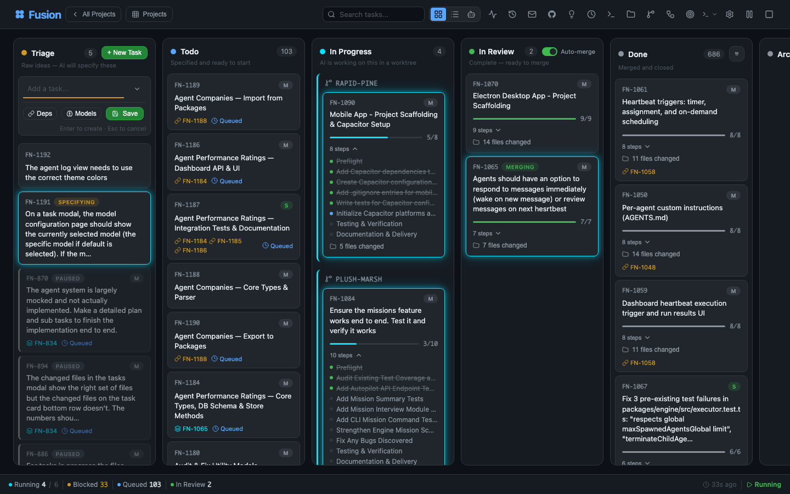
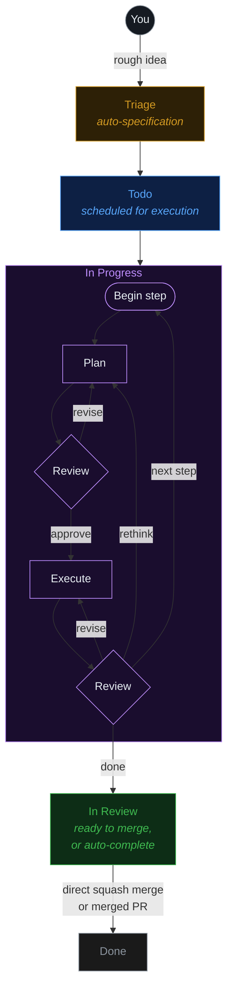

# Fusion

AI-orchestrated task board — specify, execute, and deliver tasks automatically.

Like Trello, but your tasks get specified, executed, and delivered by AI — powered by [pi](https://github.com/badlogic/pi-mono).



**Fusion** turns rough ideas into production code. Describe a task, and an AI agent writes the spec, plans the implementation, writes the code in an isolated git worktree, and merges it — with automatic code review at every step. Manage a single project or coordinate across multiple repositories from one dashboard.

## Quick Start

1. **Install:**
   ```bash
   npm i -g @gsxdsm/fusion
   ```

2. **Initialize (or just start the dashboard):**
   ```bash
   fn dashboard
   ```

3. **Open** [http://localhost:4040](http://localhost:4040) — create tasks from the board or the CLI.

**First-run setup:** On first launch, Fusion automatically opens the **Model Onboarding wizard**. It walks you through provider authentication (OAuth login or API key entry) and default model selection. The wizard is **dismissible and non-blocking** — click **Skip for now** to dismiss it and use the dashboard immediately. You can re-trigger onboarding later from Settings → Authentication, or by clearing the `modelOnboardingComplete` flag in global settings.

### Prerequisites

The AI engine uses [pi](https://github.com/badlogic/pi-mono) under the hood:

1. `npm i -g @mariozechner/pi-coding-agent`
2. Run `pi` and use `/login`, or set `ANTHROPIC_API_KEY`

Fusion reuses your existing pi authentication.

### Mobile

For Capacitor + PWA workflow, see [MOBILE.md](./MOBILE.md).

## Docker

Quick start:

```bash
docker build -t fusion . && docker run -p 4040:4040 -v $(pwd):/project -e ANTHROPIC_API_KEY=... fusion
```

For full Docker usage (env vars, persistence volumes, and runtime options), see [docs/docker.md](./docs/docker.md).

## Workflow



Tasks with dependencies are processed sequentially. Independent tasks run in parallel.

In **Triage**, an AI agent reads your project, understands context, and writes a full `PROMPT.md` specification — steps, file scope, acceptance criteria. Optionally require manual approval before tasks move to **Todo** (`requirePlanApproval` setting).

## Core Features

### Task Creation

Create tasks from the CLI, the dashboard, or import from GitHub:

```bash
fn task create "Fix the login bug"                     # Quick entry → triage
fn task create "Bug" --attach screenshot.png --depends FN-001
fn task plan "Build a user authentication system"      # AI-guided planning
fn task import owner/repo --labels bug --limit 10      # Import GitHub issues
```

**Dashboard creation options:**
- **Quick Entry** — Type a description, press Enter
- **Plan** (💡) — AI interviews you to refine requirements before creating the task; summary view supports **Break into Tasks** for multi-task generation with dependencies
- **Subtask** (🌳) — AI suggests 2–5 subtasks with drag-and-drop reordering and dependency linking
- **Refine** (✨) — Refine the description with AI: clarify, add details, expand, or simplify
- **Deps** (🔗) — Link existing tasks as dependencies before creation
- **Attach** — Attach images to the task
- **Models** (🧠) — Override executor, validator, or planning models per-task
- **Agent** — Assign a specific agent to the task
- **Save** — Manually save the task (alternative to pressing Enter)
- **AI Title Summarization** — When `autoSummarizeTitles` is enabled, tasks without titles get concise AI-generated names (≤60 characters)

### AI Execution

Each task is implemented by an AI agent with a full Plan → Review → Execute → Review cycle:

1. **Automatic spec writing** — The triage agent generates a detailed `PROMPT.md` with steps, file scope, and acceptance criteria
2. **Step-by-step execution** — For each step: plan, AI code review, implement, AI code review
3. **Session-per-step mode** — Enable `runStepsInNewSessions` to isolate each step in a fresh agent session with better retry behavior
4. **Parallel step execution** — Configure `maxParallelSteps` (1–4) to run non-conflicting steps concurrently in isolated worktrees
5. **Git worktree isolation** — Each task runs in its own worktree (`fusion/{task-id}` branch)
6. **Workflow steps** — Configurable quality gates (pre-merge: blocks merge; post-merge: informational)

Step status is tracked in real time in the dashboard so you can see pending/in-progress/done progress as the executor advances.

```bash
fn task show FN-001                    # View task details, steps, log
fn task logs FN-001 --follow --limit 50  # Stream agent execution logs
fn task steer FN-001 "Use TypeScript"  # Guide the AI worker mid-execution
```

### Dashboard

Real-time kanban board at `localhost:4040`:

- **Board view** — Drag-and-drop cards between columns, real-time search, column visibility toggle
- **List view** — Group by column or size, inline title editing, duplicate tasks
- **Agents view** — Agent list + detail panels with runtime config, heartbeat controls, metrics, and run history
- **Mailbox** — Inter-agent/user messaging UI for inbox/outbox and direct coordination
- **Interactive terminal** — Full PTY-based terminal with xterm.js, multiple tabs, mobile-aware with virtual keyboard handling that re-fits the terminal view above the on-screen keyboard on real devices (Chrome Android and iOS Safari)
- **Git manager** — View commits/diffs, manage branches, worktree associations, push/pull, inline edit controls for remote name and URL
- **Mission manager** — Hierarchical mission/milestone/slice/feature planning with progress tracking and autopilot controls
- **Activity log** — Task lifecycle events, settings changes, filter by type, auto-refresh
- **Files browser** — Browse project root or task worktrees, edit files with syntax highlighting
- **Theme system** — Dark/Light/System modes, 54 color themes (Ocean, Forest, Nord, Dracula, and more)
- **Usage dialog** — Real-time AI provider subscription usage with progress bars and reset timers
- **Spec editor** — Edit `PROMPT.md` directly, request AI revision, or rebuild/regenerate specs
- **Planning Mode (multi-task)** — After AI planning, choose **Create Task** or **Break into Tasks** to generate dependency-linked subtasks
- **Model onboarding wizard** — Guided provider/model setup from the dashboard, re-openable from Settings

### GitHub Integration

```bash
fn task import owner/repo                  # Import all open issues
fn task import owner/repo --interactive    # Interactive issue selection
fn task pr-create FN-001 --title "Fix" --base main
```

- **Real-time PR/issue badges** — Live status updates via WebSocket
- **PR creation** — Create PRs from the CLI or dashboard, linked to tasks automatically
- **PR comment monitoring** — Adaptive polling detects actionable review feedback, adds steering comments
- **Auto-completion modes** — Direct squash merge (default) or PR-first with auto-merge when checks pass
- **Follow-up tasks** — When a PR is closed/merged with unaddressed feedback, a follow-up task is created in Triage

### Merge & Review

When a task reaches **In Review**, Fusion handles merge with rich metadata:

- Merge commit SHA, files changed, insertions/deletions, timestamps
- Smart conflict resolution: lock files ("ours"), generated files ("theirs"), whitespace conflicts
- 3-attempt retry logic with escalating strategies (AI resolve → auto-resolve patterns → `git merge -X theirs`)
- **Deterministic merge verification** — Test and build commands run as hard gates before final merge completion. If any command exits non-zero, the merge is aborted and the task stays out of `done`, ensuring repository health. Commands run in order: `testCommand` first, then `buildCommand`.
- **Automatic test gate** — When `testCommand` is not explicitly configured but a package manager lock file is detected (`pnpm-lock.yaml`, `yarn.lock`, `bun.lock`, `package-lock.json`), Fusion automatically infers a default test command (`pnpm test`, `yarn test`, `bun test`, or `npm test`). This ensures merges are blocked when tests fail even without manual configuration. Explicit `testCommand` always takes precedence over inferred defaults.
- **Changes tab** — View file-level diffs from the merge commit, even after worktree cleanup. Done tasks without a recorded commit SHA show a safe summary fallback instead of inflated repository-wide diffs.

## Multi-Project Support

Fusion supports managing multiple projects from a single installation. Register projects, switch between them with a global `--project` flag, and monitor all activity from a unified dashboard.

### Project Management

```bash
fn project add my-app /path/to/app       # Register a project
fn project list                           # List all projects
fn project show my-app                    # Show project details and health
fn project set-default my-app             # Set default project
fn project detect                         # Detect project from current directory
fn project remove my-app [--force]        # Unregister a project
```

### The `--project` Flag

All task commands accept `--project` (or `-P`) to target a specific project:

```bash
fn task create "Fix login bug" --project my-app
fn task list --project my-app
fn task show FN-001 --project my-app
fn settings set maxConcurrent 4 --project my-app
fn git status --project my-app
fn backup --create --project my-app
```

### Project Resolution

When you run a command without `--project`, Fusion resolves the project in this order:
1. Explicit `--project` flag
2. Default project (set via `fn project set-default`)
3. CWD auto-detection (walks up looking for `.fusion/fusion.db`)

### Architecture

- **Central database** at `~/.pi/fusion/fusion-central.db` — project registry, unified activity feed, global concurrency
- **Per-project databases** at `.fusion/fusion.db` — SQLite with WAL mode for concurrent access
- **Global concurrency management** — System-wide agent slot limits across projects
- **Isolation modes** — `in-process` (default, low overhead) or `child-process` (strong isolation with crash containment)

Auto-migration is seamless: existing single-project users are automatically migrated on first run. Rollback is safe — delete the central database and per-project data remains intact.

## Task Management

### Commands

**Dashboard:**
```bash
fn dashboard                              # Start the web UI (default port 4040)
fn dashboard --interactive                # Start with interactive port selection
fn dashboard --paused                     # Start with automation paused
fn dashboard --dev                        # Start web UI only (no AI engine)
fn desktop                                # Launch Electron desktop app with embedded dashboard server
fn desktop --dev                          # Launch desktop app against Vite dev renderer (hot-reload)
fn desktop --paused                       # Launch desktop app with automation paused
```

**Task Operations:**
```bash
fn task create "Fix the login bug"         # Create a new task (goes to triage)
fn task plan "Build auth system"          # Create task via AI-guided planning
fn task list                              # List all tasks
fn task show FN-001                       # Show task details, steps, log
fn task logs FN-001 [--follow] [--limit 50] [--type tool]
fn task move FN-001 todo                   # Move a task to a column
fn task merge FN-001                     # Merge an in-review task
fn task duplicate FN-001                 # Duplicate a task (copy to triage)
fn task refine FN-001 --feedback "Add tests"  # Create refinement task
fn task archive FN-001                   # Archive a done task
fn task unarchive FN-001                 # Restore an archived task
fn task delete FN-001 [--force]          # Delete a task
fn task retry FN-001                     # Retry a failed task
fn task comment FN-001 "Looks good"      # Add a general task comment
fn task comments FN-001                  # List task comments
fn task steer FN-001 "Use TypeScript"    # Add steering comment
fn task pause FN-001                     # Pause automation for task
fn task unpause FN-001                   # Resume automation for task
```

**Mission Management:**
```bash
fn mission create "Title" "Description"    # Create a new mission
fn mission list                             # List all missions
fn mission show <id>                        # Show mission with hierarchy
fn mission delete <id> [--force]            # Delete mission (cascades to children)
fn mission activate-slice <slice-id>        # Manually activate a pending slice
```

**Agent Management & Messaging:**
```bash
fn agent stop <id>                          # Stop a running agent
fn agent start <id>                         # Start/resume a stopped agent
fn agent import <source> [--dry-run] [--skip-existing]
                                            # Import agents from companies.sh packages
fn agent mailbox <id>                       # View one agent's mailbox

fn message inbox                            # List inbox messages
fn message outbox                           # List sent messages
fn message send <agent-id> <msg>            # Send a message to an agent
fn message read <id>                        # Read a specific message
fn message delete <id>                      # Delete a message
```

**Git Commands:**
```bash
fn git status                             # Show branch, commit, dirty state
fn git fetch [remote]                     # Fetch from remote
fn git pull [--yes]                       # Pull current branch
fn git push [--yes]                       # Push current branch
```

**Settings:**
```bash
fn settings                               # Show current configuration
fn settings set maxConcurrent 4          # Update a setting
fn settings export --scope both           # Export settings to JSON
fn settings import fusion-settings.json --yes  # Import settings
```

**Backup & Restore:**
```bash
fn backup --create                         # Create a database backup immediately
fn backup --list                           # List all backups with sizes
fn backup --restore backup-file.db        # Restore database from backup
fn backup --cleanup                        # Remove old backups exceeding retention
```

### Task Comments vs Steering Comments

Fusion supports two distinct kinds of discussion on a task:

- **Task comments** — General collaboration notes for humans. Add from the dashboard or CLI with `fn task comment <id> "message"`.
- **Steering comments** — Execution guidance aimed at the AI worker. Use for actionable direction like "change this approach." Also populated automatically from actionable PR review feedback.

### Refinement Tasks

`fn task refine` creates a follow-up task in Triage that depends on the original. The title follows the format `Refinement: {source label}` for easy identification.

### Spec Editing, Revision, and Rebuild

From the dashboard task detail modal:
- **Edit spec** — Update `PROMPT.md` directly
- **AI revision** — Submit feedback and ask AI to revise the current specification
- **Respecify/Rebuild** — Regenerate the specification and move the task back to triage for a fresh spec/review cycle

Use rebuild when requirements changed significantly or the spec drifted from current project reality.

### Archive

Completed tasks can be archived to keep the board focused:

```bash
fn task archive FN-001        # Archive a done task
fn task unarchive FN-001      # Restore an archived task to done
```

Archive cleanup removes task directories while preserving compact metadata in `.fusion/archive.jsonl`. Restored tasks keep all metadata but lose attachments and agent logs. Archived tasks appear in a collapsed "Archived" column in the dashboard.

## Model System

Fusion provides flexible AI model configuration with support for model presets, per-task overrides, and a hierarchical settings system.

### Model Presets

Model presets let teams standardize AI model choices. Each preset contains:
- **ID** — stable slug for storage (e.g., `budget`, `normal`, `complex`)
- **Name** — human-friendly label
- **Executor model** — provider/model pair for task execution
- **Validator model** — provider/model pair for code/spec review

Presets can be auto-selected by task size:
- **Small (S)** → Budget preset
- **Medium (M)** → Normal preset
- **Large (L)** → Complex preset

### Per-Task Model Overrides

Override global models for specific tasks:
- **Executor Model** — AI model that implements the task
- **Validator Model** — AI model that reviews code and plans

Set overrides in the dashboard via **task detail → Model tab**, or choose **Custom** during task creation.

### Settings Hierarchy

**Global settings** (`~/.pi/fusion/settings.json`):
- `defaultProvider` / `defaultModelId` — Default AI models
- `planningProvider` / `planningModelId` — Task specification models
- `validatorProvider` / `validatorModelId` — Review models
- `themeMode`, `colorTheme` — UI preferences
- `ntfyEnabled`, `ntfyTopic` — Push notifications

**Project settings** (`.fusion/config.json`):
- `modelPresets` — Custom preset definitions
- `autoSelectPresetBySize` — Size-to-preset mappings
- All workflow and automation settings

Project settings override global settings. Configure in the dashboard under **Settings > Model**.

### Agent Log Model Display

The dashboard Agent Log subview shows which AI models were used for each task (Executor, Validator, Planning/Triage). When no model can be resolved, the header shows "Using default".

## Agents Management

Fusion includes a dedicated **Agents view** in the dashboard for operating autonomous workers:

- Agent list with status and assignment
- Detail panel with runtime configuration and custom instructions
- Health/heartbeat status, recent activity, and run history
- Metrics panels for throughput and reliability trends

### Agent Presets and Prompt Templates

Built-in prompt templates are available for common roles:

- `default-executor`, `default-triage`, `default-reviewer`, `default-merger`
- `senior-engineer`, `strict-reviewer`, `concise-triage`

Assign templates per role with the `agentPrompts` project setting, and add custom templates for team-specific behavior. You can also set per-agent custom instructions in the dashboard.

### Fine-Grained Prompt Overrides

The **Prompts** section in the Settings modal (dashboard) allows you to customize specific segments of AI agent prompts without replacing entire role templates. This enables surgical customization of prompt sections like:

- Executor welcome, guardrails, spawning instructions, completion criteria
- Triage welcome and context
- Reviewer verdict criteria
- Merger conflict resolution instructions
- Agent generation and workflow step prompts

Each prompt shows its built-in description, allows text editing, and provides a Reset button to restore the default. Overrides are stored in the project settings and fall back to built-in defaults when cleared.

### Agent Controls (CLI)

```bash
fn agent stop <id>
fn agent start <id>
fn agent import <source> [--dry-run] [--skip-existing]
fn agent mailbox <id>
```

### Agent Import

Fusion can import agents from [companies.sh](https://companies.sh) packages. The importer supports:

- **Single manifest import** — Import a single `AGENTS.md` file as an independent agent
- **Team package import** — Import a full companies.sh package with `COMPANY.md`, `TEAM.md`, and `AGENTS.md` files
- **Archive import** — Import from `.tar.gz`, `.tgz`, or `.zip` archives

#### Team Hierarchy

When importing a companies.sh package with team structure, Fusion preserves the manager/report hierarchy for both dashboard and CLI imports:

- Team managers are imported with their defined capabilities and instructions
- Manifest-style manager references such as `ceo`, `../ceo/AGENTS.md`, and already-valid Fusion agent IDs are resolved into real Fusion `reportsTo` agent IDs before agents are persisted
- Partial imports and `--skip-existing` runs reuse matching existing Fusion agents as managers when possible, so follow-up imports keep the same org tree instead of flattening new reports
- The import summary shows team count and hierarchy links

#### CLI Usage

```bash
# Import a single agent manifest
fn agent import ./path/to/AGENTS.md

# Import a full companies.sh package
fn agent import ./path/to/companies-package/

# Import from archive
fn agent import ./path/to/package.tar.gz

# Preview without creating
fn agent import ./path/to/package/ --dry-run

# Skip agents that already exist
fn agent import ./path/to/package/ --skip-existing
```

#### Dashboard Import

The Agents view provides a directory picker for importing companies.sh packages:

1. Click **Import** in the Agents view header
2. Select **Import from Directory** or paste a manifest directly
3. Choose a companies.sh package folder or single manifest
4. Preview the import with company/team metadata
5. Confirm to create agents with hierarchy

### Per-Agent Heartbeat Configuration

Each agent can override heartbeat behavior through `runtimeConfig`:
- `enabled`
- `heartbeatIntervalMs`
- `heartbeatTimeoutMs`
- `maxConcurrentRuns`

Configure this in the agent detail panel (**Heartbeat Settings**). These values control timer triggers, unresponsive detection, and concurrent run limits per agent.

## Inter-Agent Messaging

Fusion provides built-in messaging for coordination between users and agents.

- **Dashboard mailbox UI** — Inbox/outbox view and conversation management
- **CLI messaging** — Send and manage direct messages from terminal workflows

```bash
fn message send <agent-id> <msg>
fn message inbox
fn message outbox
fn message read <id>
fn message delete <id>
```

Use messaging for handoffs ("review this next"), clarifications, and explicit coordination between specialized agents.

## Missions

The Missions system provides a hierarchical planning structure for large-scale projects:

```
Mission ("Build Auth System")
├── Milestone 1: "Database Schema"
│   ├── Slice 1: "User Tables"
│   │   ├── Feature 1: "User model" → Task FN-101
│   │   └── Feature 2: "Session table" → Task FN-102
│   └── Slice 2: "Token Storage"
│       └── Feature 3: "Refresh tokens" → Task FN-103
├── Milestone 2: "API Endpoints"
│   └── Slice 3: "Login/Logout"
│       ├── Feature 4: "Login endpoint" → Task FN-104
│       └── Feature 5: "Logout endpoint" → Task FN-105
└── Milestone 3: "UI Integration"
    └── Slice 4: "React Components"
        └── Feature 6: "Login form" → Task FN-106
```

**Hierarchy:** Mission → Milestone → Slice → Feature → Task

Status flows automatically: when features are linked to tasks and completed, slice status updates. When all slices in a milestone are complete, the milestone becomes complete. When all milestones are done, the mission is complete.

### Mission Autopilot

Enable **autopilot** to let Fusion progress a mission with less manual intervention.

- `autopilotEnabled` — Primary control to enable active monitoring and progression orchestration for a mission
- `autoAdvance` — Legacy compatibility field (deprecated); autopilot uses `autopilotEnabled` as the canonical control

When autopilot is enabled, the runtime tracks task completions and advances mission state through:

`inactive → watching → activating → completing`

**Recovery behavior:** When autopilot is enabled and re-engaged (via `/resume`, PATCH `/autopilot`, or POST `/autopilot/start`), the system automatically calls `recoverStaleMission` to reconcile any inconsistent state (defined features without tasks, stale feature status, etc.) and progress if possible.

Autopilot API endpoints:

- `GET /api/missions/:missionId/autopilot`
- `PATCH /api/missions/:missionId/autopilot` (`{ enabled: boolean }`)
- `POST /api/missions/:missionId/autopilot/start`
- `POST /api/missions/:missionId/autopilot/stop`

## Workflow Steps

Workflow steps are reusable quality gates that run at configurable lifecycle phases. Each step can run as **prompt** (AI agent review) or **script** (deterministic command), and at **pre-merge** (blocks merge) or **post-merge** (informational) phase.

### Execution Phases

| Phase | When it runs | Failure behavior |
|-------|-------------|-----------------|
| **Pre-merge** (default) | After task implementation, before in-review | Blocks merge — task stays in in-review |
| **Post-merge** | After successful merge to main | Logged only — does not block or rollback |

### Execution Modes

| Mode | How it works | Use for |
|------|-------------|---------|
| **Prompt** | Read-only AI agent reviews changes | Code review, security audits, documentation checks |
| **Script** | Runs a named script from `settings.scripts` | Test suites, linting, type checking |

```json
{
  "scripts": {
    "test": "pnpm test",
    "lint": "pnpm lint",
    "typecheck": "pnpm tsc --noEmit"
  }
}
```

Prompt-mode steps support **model overrides** — pin a specific AI model per quality gate. Script-mode steps run with a 2-minute timeout.

### Built-in Templates

| Template | Category | Description |
|----------|----------|-------------|
| **Documentation Review** | Quality | Verify all public APIs have documentation |
| **QA Check** | Quality | Run tests, check for bugs |
| **Security Audit** | Security | Check for vulnerabilities and anti-patterns |
| **Performance Review** | Quality | Check for performance anti-patterns |
| **Accessibility Check** | Quality | Verify WCAG 2.1 compliance |
| **Browser Verification** | Quality | Verify end-to-end web behavior using browser automation |
| **Frontend UX Design** | Quality | Verify visual polish and design token consistency |

Click **Add** on any template in the Workflow Step Manager to create a customizable step.

### Default On for New Tasks

Workflow steps can be marked as **"Default on for new tasks"** in the Workflow Step Manager. When enabled:

- The step is automatically pre-selected in the task creation form
- A gold "Default on" badge appears on the step card in the manager
- Users can still deselect the step — this only controls the initial default state

**Behavior during task creation:**

| Scenario | What happens |
|----------|-------------|
| User creates task, doesn't modify workflow steps | Auto-selected defaults are applied; backend sends the selected steps |
| User deselects all auto-selected steps | Empty array is sent to backend — no workflow steps run |
| User adds additional steps | All selected steps (auto + manual) are included |
| User re-opens task creation modal | Defaults are re-applied for the new session |

Edit mode never auto-injects workflow steps — existing task selections are preserved.

### Using Workflow Steps

1. When creating or editing a task, check the workflow steps you want
2. Reorder with ▲/▼ buttons when two or more are selected
3. Pre-merge steps must all pass before the task moves to in-review
4. Post-merge steps run automatically after merge — results appear in the Workflow tab
5. View results in the task detail modal's **Workflow** tab

**Revision Loop:** If a pre-merge step identifies issues that need code changes, it can request a revision. The executor generates "Workflow Revision Instructions" in the task's PROMPT.md, resets all steps, and routes the task back to in-progress for a fresh implementation pass. Hard failures (e.g., broken test infrastructure) still move the task to in-review with a failed status.

## Architecture

### Storage

Fusion uses a hybrid storage architecture: structured metadata in **SQLite** with WAL mode for concurrent access, and large files (specs, logs, attachments) on the filesystem.

```
.fusion/
├── fusion.db                # SQLite database (tasks, config, activity log, agents)
├── config.json              # Project config + settings (synced to SQLite)
├── memory.md                # Project memory — durable learnings across task runs
└── tasks/
    └── FN-001/
        ├── task.json.bak    # Legacy backup (after migration)
        ├── PROMPT.md        # Task specification
        └── attachments/     # File attachments
```

### AI Engine

The AI engine starts automatically with the dashboard. Three components run:

- **TriageProcessor** — Watches triage column. Spawns an AI agent that reads the project, understands context, and writes a full `PROMPT.md` specification. When the reviewer flags a task as oversized (8+ steps, 3+ packages, multiple independent deliverables), the triage agent proactively splits it into 2–5 child tasks using `task_create` and closes the parent. Moves approved single tasks to todo.

- **Scheduler** — Watches todo column. Resolves dependency graphs. Moves tasks to in-progress when deps are satisfied and concurrency allows (default: 2 concurrent). When `groupOverlappingFiles` is enabled, tasks whose file scopes overlap are serialized to prevent merge conflicts.

- **TaskExecutor** — Listens for tasks entering in-progress. Creates a git worktree, spawns an AI agent with full coding tools scoped to the worktree, and executes the specification. If the task has enabled pre-merge workflow steps, runs them sequentially before moving to in-review.

Each AI agent session gets:
- Custom system prompt for its role
- Tools scoped to the correct directory
- In-memory sessions with auto-compaction for long conversations
- Your existing pi auth (API keys from `~/.pi/agent/auth.json`)

### Error Recovery

The engine automatically recovers from transient failures using bounded exponential backoff:

- **Recoverable failures** — Transient errors trigger retry with increasing delay (60s → 120s → 240s, capped at 5 minutes). Up to 3 retries before permanent failure.
- **Stale worktree/branch references** — Automatic pruning, branch deletion, and force-ref cleanup.
- **Stuck task detection** — When `taskStuckTimeoutMs` is set, tasks with no agent activity are terminated and re-queued. Detects both dead sessions (no heartbeats) and loops (active but no step progress). Loop recovery attempts compact-and-resume before kill/requeue.
- **Specification staleness** — When `specStalenessEnabled` is `true`, tasks with specifications older than `specStalenessMaxAgeMs` are automatically sent back to triage for re-specification. Default: 6 hours (21600000 ms).
- **Context-limit recovery** — When an LLM returns context-window overflow, the executor compacts the session and resumes with a fresh prompt.

### Project Memory

When `memoryEnabled` is `true` (the default), Fusion maintains a **project memory file** at `.fusion/memory.md` that accumulates durable learnings across task runs. This file is automatically created with a standard scaffold when:

1. A project is initialized with memory enabled (the default)
2. Memory is toggled from `false` to `true` via settings

The memory file is never overwritten — if it already exists (even with custom content), the bootstrap is a no-op.

**What goes in memory:**
- Architecture patterns and module boundaries
- Project-specific coding conventions and naming standards
- Known pitfalls and things to avoid
- Important context about dependencies, deployment, or constraints

**What does NOT go in memory:**
- Task-specific implementation logs or changelog entries
- Transient failures resolved without broader lessons
- One-off file paths, variable names, or minor code changes
- Notes about what you did rather than what future agents should know

**How agents use it:**
- **Triage agent** — Reads memory before writing specifications, incorporating documented patterns and constraints
- **Executor agent** — Reads memory at the start of execution. At the end, selectively updates memory only when genuinely durable insights were discovered. Agents skip updates when nothing durable was learned and prefer consolidating or editing existing entries over always appending.

The memory path is always the project-root `.fusion/memory.md`, never a worktree-local path. Agents running in worktrees access the file at its project-root location.

To disable project memory:
```json
{
  "memoryEnabled": false
}
```

### Pluggable Memory Backends

Fusion supports pluggable memory backends, allowing you to choose how project memory is stored and managed:

```json
{
  "memoryBackendType": "file"
}
```

**Available backends:**

| Backend | Description | Capabilities |
|---------|-------------|--------------|
| `file` (default) | File-based storage in `.fusion/memory.md` | Read/Write, Atomic, Persistent |
| `readonly` | Read-only access (external memory management) | Read only, Non-persistent |
| `qmd` | QMD (Quantized Memory Distillation) CLI backend | Read/Write, Persistent |

**QMD Backend**

The QMD backend (`memoryBackendType: "qmd"`) routes memory operations through a QMD CLI tool, enabling advanced features like automatic summarization and structured querying. When QMD is unavailable (binary not found or command fails), it falls back to file-based storage automatically.

**Fallback Behavior:**
- QMD binary not found (exit code 127): Falls back to file backend
- QMD command timeout (30 seconds): Falls back to file backend
- QMD command fails with exit code 1: Falls back to file backend
- QMD output malformed: Returns error, does not fall back

**Using the dashboard API:**

```bash
# Get current backend status
curl http://localhost:4040/api/memory/backend

# Response
{
  "currentBackend": "file",
  "capabilities": {
    "readable": true,
    "writable": true,
    "supportsAtomicWrite": true,
    "hasConflictResolution": false,
    "persistent": true
  },
  "availableBackends": ["file", "readonly", "qmd"]
}
```

## Packages

| Package | Description |
|---------|-------------|
| `@fusion/core` | Domain model — tasks, board columns, SQLite store |
| `@fusion/dashboard` | Web UI — Express server + kanban board with SSE |
| `@fusion/engine` | AI engine — triage, execution, scheduling, workflow steps |
| `@fusion/tui` | Terminal UI — Ink-based CLI components |
| `@gsxdsm/fusion` | CLI + pi extension — published to npm |

## Configuration Reference

Fusion uses a two-tier settings hierarchy:
- **Global settings** (`~/.pi/fusion/settings.json`) — User preferences across all projects
- **Project settings** (`.fusion/config.json`) — Project-specific workflow settings

Project settings override global settings. Configure in the dashboard under **Settings**.

### Settings Table

| Setting | Scope | Default | Description |
|---------|-------|---------|-------------|
| `defaultProvider` | Global | - | Default AI model provider |
| `defaultModelId` | Global | - | Default AI model ID |
| `planningProvider` | Global | - | Model provider for task specification |
| `planningModelId` | Global | - | Model ID for task specification |
| `validatorProvider` | Global | - | Model provider for code/spec review |
| `validatorModelId` | Global | - | Model ID for review |
| `defaultThinkingLevel` | Global | - | Default thinking effort level |
| `themeMode` | Global | dark | UI theme: dark/light/system |
| `colorTheme` | Global | default | Color theme name |
| `ntfyEnabled` | Global | false | Enable push notifications |
| `ntfyTopic` | Global | - | ntfy.sh topic for notifications |
| `ntfyDashboardHost` | Global | - | Dashboard URL for notification deep links |
| `modelOnboardingComplete` | Global | false | Tracks completion of first-run model onboarding wizard |
| `maxConcurrent` | Project | 2 | Concurrent task execution lanes (triage, executor, merge). Utility AI workflows (planning, subtask breakdown, interviews, heartbeat wake, title summarization) bypass this limit. |
| `autoMerge` | Project | true | Auto-merge completed tasks |
| `smartConflictResolution` | Project | true | Auto-resolve lock/generated files |
| `requirePlanApproval` | Project | false | Manual approval for AI specs |
| `taskStuckTimeoutMs` | Project | - | Stuck task detection timeout (ms) |
| `specStalenessEnabled` | Project | false | Enable specification staleness enforcement |
| `specStalenessMaxAgeMs` | Project | 21600000 | Max spec age before re-triaging (ms, default 6h) |
| `runStepsInNewSessions` | Project | false | Run each task step in its own agent session |
| `maxParallelSteps` | Project | 2 | Max concurrent steps when per-step sessions are enabled |
| `worktreeNaming` | Project | random | Worktree naming: random/task-id/task-title |
| `recycleWorktrees` | Project | false | Pool and reuse worktrees for efficiency |
| `groupOverlappingFiles` | Project | false | Serialize tasks with shared file scopes |
| `agentPrompts` | Project | - | Role-based prompt templates and assignments |
| `promptOverrides` | Project | - | Fine-grained prompt segment overrides |
| `autoSummarizeTitles` | Project | false | Auto-generate titles for untitled tasks |
| `memoryEnabled` | Project | true | Enable/disable project memory |
| `memoryBackendType` | Project | file | Memory backend: file/readonly |
| `autoBackupEnabled` | Project | false | Enable automatic database backups |
| `autoBackupSchedule` | Project | `0 2 * * *` | Cron expression for backup schedule |
| `autoBackupRetention` | Project | 7 | Number of backups to retain (1–100) |
| `prCompletionMode` | Project | direct | Completion: direct/pr-first |

### Key Settings Explained

**Smart Conflict Resolution:**
```json
{
  "settings": {
    "smartConflictResolution": true
  }
}
```
Automatically resolves lock files ("ours"), generated files ("theirs"), and trivial whitespace conflicts during merge.

**Stuck Task Detection:**
```json
{
  "settings": {
    "taskStuckTimeoutMs": 600000
  }
}
```
Terminates and retries tasks with no agent activity for 10 minutes. Detects dead sessions and loops separately, with compact-and-resume recovery for loops.

**Specification Staleness:**
```json
{
  "settings": {
    "specStalenessEnabled": true,
    "specStalenessMaxAgeMs": 21600000
  }
}
```
When enabled, tasks with specifications (PROMPT.md) older than the configured threshold are automatically sent back to triage for re-specification. Default: 6 hours (21600000 ms). Stored in milliseconds; dashboard UI accepts hours and converts automatically.

**Push Notifications:**
```json
{
  "settings": {
    "ntfyEnabled": true,
    "ntfyTopic": "my-kb-notifications"
  }
}
```
Get notified when tasks complete, merge, fail, need approval, or need human review. Includes dashboard deep links when `ntfyDashboardHost` is set.

**Plan Approval:**
```json
{
  "settings": {
    "requirePlanApproval": true
  }
}
```
AI-generated specifications require manual approval before moving to Todo. Tasks show "Awaiting Approval" status with amber highlighting.

**Comment-Aware Triage & Spec Review:**

User comments on triage tasks are automatically consumed during specification generation and spec review:

- **During triage**: The AI triage agent sees all user comments as explicit feedback context, ensuring the specification addresses every user concern.
- **During spec review**: The reviewer explicitly verifies that every user comment is addressed in the PROMPT.md. Missing comment coverage results in a `REVISE` verdict.
- **Stale approval invalidation**: If a new user comment arrives after the spec was approved, the approval is automatically invalidated. The task returns to triage with `needs-respecify` status, triggering re-specification and re-review before the task can advance to execution. This prevents stale specs from reaching the execution phase when users provide late feedback.

**Auto-Backup:**
```json
{
  "settings": {
    "autoBackupEnabled": true,
    "autoBackupSchedule": "0 2 * * *",
    "autoBackupRetention": 7
  }
}
```
Automatic SQLite database backups with configurable schedule, retention, and directory.

**Worktree Naming & Recycling:**
```json
{
  "settings": {
    "worktreeNaming": "task-id",
    "recycleWorktrees": true
  }
}
```
- `worktreeNaming`: Control directory names — `random` (human-friendly like `swift-falcon`), `task-id` (e.g., `fn-042`), or `task-title` (slugified title)
- `recycleWorktrees`: Pool and reuse worktree directories for efficiency instead of creating new ones per task

## Scheduled Tasks

Automate recurring workflows with multi-step scheduled tasks:

| Preset | Cron | Description |
|--------|------|-------------|
| `every15Minutes` | `*/15 * * * *` | Every 15 minutes |
| `hourly` | `0 * * * *` | Every hour |
| `daily` | `0 0 * * *` | Daily at midnight |
| `weekdays` | `0 0 * * 1-5` | Weekdays at midnight |
| `weekly` | `0 0 * * 0` | Weekly on Sunday |
| `custom` | — | Define your own cron |

Each schedule contains multiple steps executed sequentially. Steps can be commands (with timeout and `continueOnFailure` options) or AI prompts. Step creation works in all browser environments, including non-secure contexts (HTTP) where `crypto.randomUUID()` is unavailable, via deterministic fallback ID generation. Access via the **Scheduled Tasks** button in the dashboard header.

## Development

```bash
pnpm install
pnpm lint                      # Lint all packages
pnpm dev:ui                     # Dashboard only; builds and typechecks first
pnpm dev dashboard              # Board + AI engine
pnpm dev task list              # CLI commands
pnpm --filter @fusion/desktop dev   # Desktop hot-reload workflow (renderer + Electron)
pnpm build:desktop              # Production desktop build pipeline
pnpm typecheck                  # Type-check all packages (no build required)
pnpm test                       # Run all tests
```

### Building a Standalone Executable

Build a single self-contained `fn` binary using [Bun](https://bun.sh/):

```bash
pnpm build:exe                  # Build for current platform
pnpm build:exe:all              # Cross-compile for all platforms
```

| Target | Output |
|--------|--------|
| `bun-linux-x64` | `fusion-linux-x64` |
| `bun-linux-arm64` | `fusion-linux-arm64` |
| `bun-darwin-x64` | `fusion-darwin-x64` |
| `bun-darwin-arm64` | `fusion-darwin-arm64` |
| `bun-windows-x64` | `fusion-windows-x64.exe` |

Override the dashboard asset path via `FUSION_CLIENT_DIR` environment variable. Prerequisites: Bun ≥ 1.0.

## Releases

Packages are published to npm automatically via GitHub Actions and [changesets](https://github.com/changesets/changesets).

```bash
npm install -g @gsxdsm/fusion
```

See [RELEASING.md](./RELEASING.md) for the full workflow. In short: add a changeset with `pnpm changeset`, merge to main, then merge the auto-generated "Version Packages" PR.

## License

ISC
